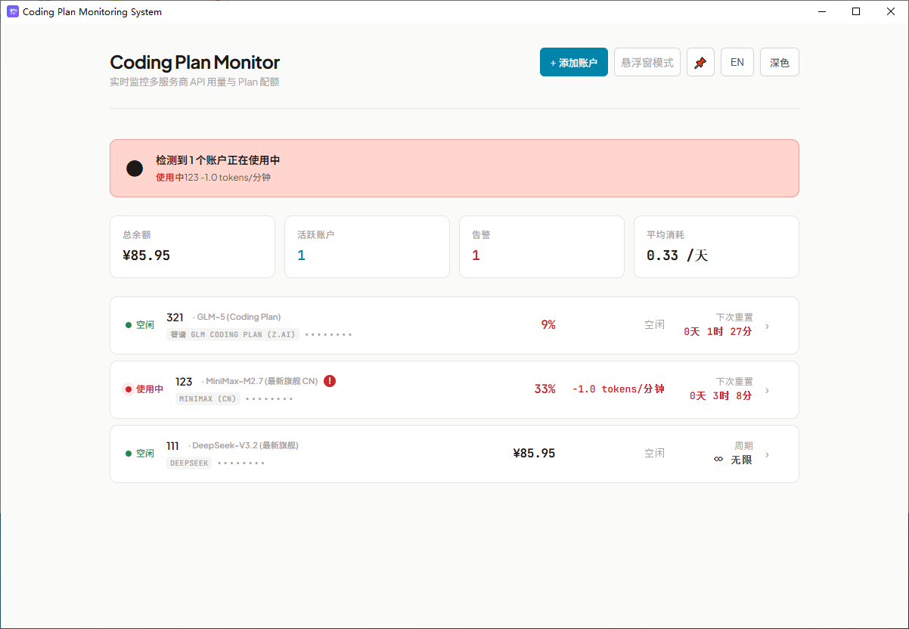
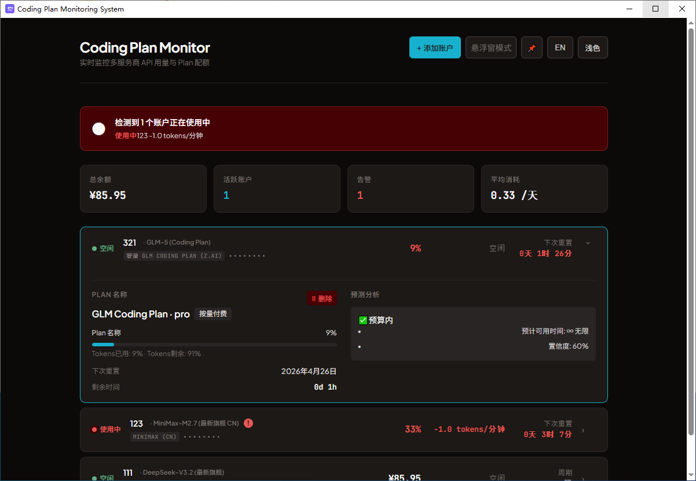
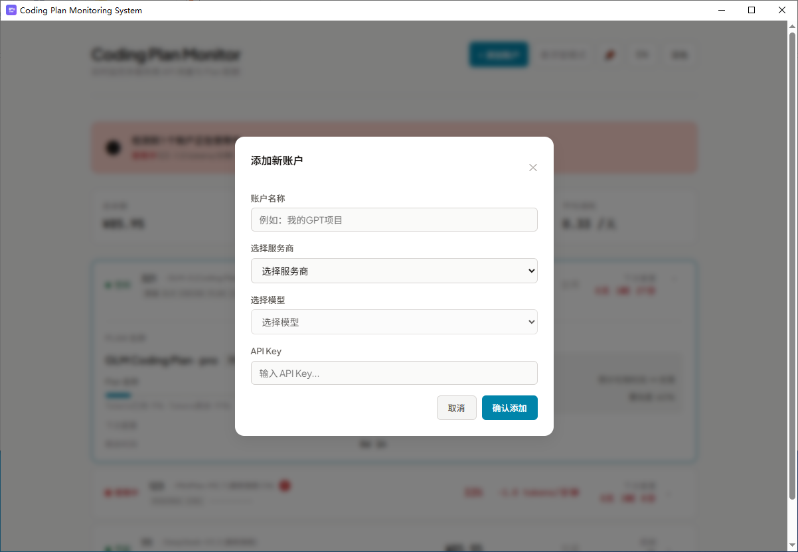
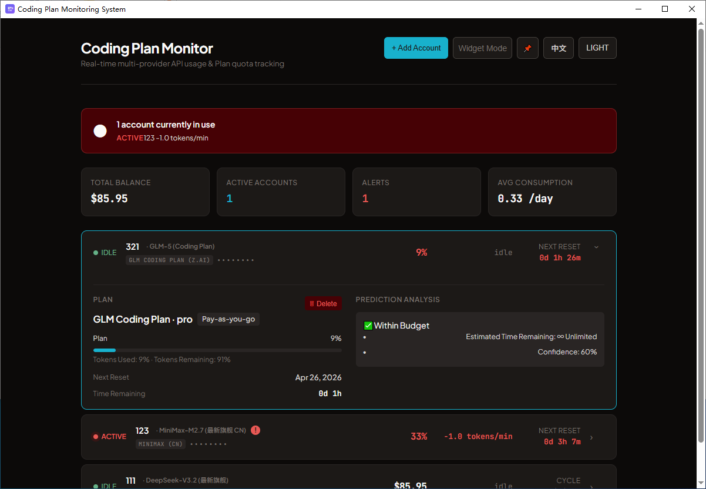
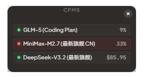
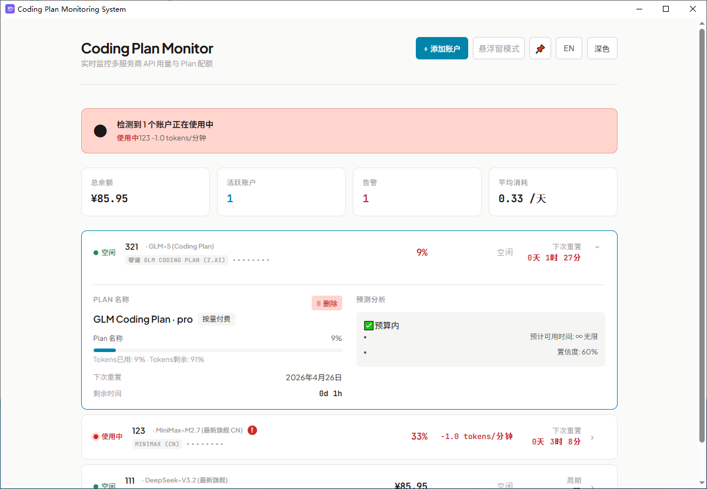

<div align="center">

# CPMS - Coding Plan Monitoring System

**Coding Plan Monitoring System** — 实时监控多服务商 API 用量与 Plan 配额的桌面工具

[](https://v2.tauri.app/)
[](https://react.dev/)
[](https://www.typescriptlang.org/)
[](LICENSE)

[中文](#-中文文档) | [English](#-english-documentation)

</div>

---

## 🇨🇳 中文文档

### 📸 预览

<table>
  <tr>
    <td align="center"><b>☀️ 浅色模式 — 仪表盘</b></td>
    <td align="center"><b>🌙 深色模式 — 仪表盘</b></td>
  </tr>
  <tr>
    <td></td>
    <td></td>
  </tr>
  <tr>
    <td align="center"><b>📊 浅色模式 — 账户详情面板</b></td>
    <td align="center"><b>📊 深色模式 — 账户详情面板</b></td>
  </tr>
  <tr>
    <td></td>
    <td></td>
  </tr>
  <tr>
    <td align="center"><b>🪟 悬浮窗模式</b></td>
    <td align="center"><b>➕ 添加账户</b></td>
  </tr>
  <tr>
    <td></td>
    <td></td>
  </tr>
</table>

### ✨ 功能特性

| 功能 | 描述 |
|------|------|
| 🔍 **实时监控** | 10秒快照检测 + 60秒长效追踪，精准捕捉每次 API 调用 |
| 🏢 **多服务商** | 智谱 GLM、GLM Coding Plan (z.ai)、MiniMax (CN/Global)、DeepSeek |
| 🤖 **模型级追踪** | 每个账户绑定具体模型（如 GLM-5、MiniMax-M2.7），独立状态显示 |
| 📈 **消耗速率** | 实时速率显示（tokens/分钟 或 货币/分钟），带颜色告警 |
| 🔮 **超支预测** | 基于消耗速率预测配额耗尽时间，与重置周期智能对比 |
| ⏰ **重置倒计时** | 实时显示距配额重置的天/时/分 |
| 🪟 **悬浮窗** | 毛玻璃效果始终置顶迷你窗口，一眼掌握所有账户状态 |
| 🌐 **中英双语** | 一键切换，界面完全本地化 |
| 🎨 **深色/浅色** | 跟随系统或手动切换 |
| 🔒 **隐私优先** | 所有数据本地存储，API 密钥 AES-GCM 加密，零遥测 |

### 🏪 支持的服务商

| 服务商 | 支持模型 | 计费方式 |
|--------|---------|---------|
| **智谱 GLM** | GLM-5.1, GLM-5, GLM-4-Plus, GLM-4-Air, GLM-4-Flash, GLM-4-Long, GLM-4V-Plus | 按量付费 |
| **GLM Coding Plan** | GLM-5.1, GLM-5, GLM-4.7, GLM-4.6, GLM-4.5, GLM-4.5-Air | Coding Plan (z.ai) |
| **MiniMax (CN)** | MiniMax-M2.7, MiniMax-M2.5, MiniMax-M2.1, MiniMax-M2-her, Hailuo 2.3 | Token 套餐 |
| **MiniMax (Global)** | MiniMax-M2.7, MiniMax-M2.5, MiniMax-M2.1, MiniMax-M2-her, Hailuo 2.3 | Token 套餐 |
| **DeepSeek** | DeepSeek-V3.2, DeepSeek-R1, DeepSeek-Coder, DeepSeek-V3.1 | 按量付费 |

### 🚀 快速开始

#### 环境要求

| 依赖 | 版本 |
|------|------|
| Node.js | >= 18 |
| Rust | >= 1.75（[安装指南](https://rustup.rs)） |
| 操作系统 | Windows 10+ / macOS 12+ |

#### 安装与运行

```bash
git clone https://github.com/creditai/Coding-Plan-Monitoring-System.git
cd Coding-Plan-Monitoring-System
npm install
npm run tauri dev
```

#### 构建生产版本

```bash
npm run tauri build
```

输出路径：`src-tauri/target/release/bundle/`

### 🛠️ 技术栈

| 层级 | 技术 |
|------|------|
| 桌面框架 | [Tauri 2.0](https://v2.tauri.app/)（Rust + Webview2） |
| 前端 | React 18 + TypeScript + Vite |
| 状态管理 | [Zustand](https://zustand.pmnd.rs/) + localStorage 持久化 |
| 国际化 | 自定义双语系统（零运行时依赖） |
| 样式 | CSS 变量（深色/浅色主题自适应） |
| 加密 | AES-GCM（通过 Tauri 调用 OS 机器密钥） |

### 🏗️ 架构

```
Coding Plan Monitoring System
├── 🖥️ 桌面应用 (Tauri 2)
│   ├── 📊 仪表盘模式 — 完整监控视图
│   │   ├── 账户列表（状态、余额、消耗速率、重置倒计时）
│   │   ├── 详情面板（预测分析、最近活动、进度条）
│   │   └── 统计总览（总余额、活跃账户、平均消耗）
│   └── 🪟 悬浮窗模式 — 紧凑置顶迷你窗口
│       ├── 毛玻璃半透明效果
│       ├── 始终置顶 + 可拖拽
│       └── 鼠标悬停显示关闭按钮
├── ⚙️ 后端 (Rust)
│   ├── 服务商 API 适配器（GLM、MiniMax、DeepSeek）
│   ├── 机器密钥生成（用于 API Key AES-GCM 加密）
│   └── 余额/配额查询（支持 JWT Token 认证）
└── 💾 存储
    ├── localStorage — 账户数据、偏好设置、快照历史
    └── 加密 API Keys — AES-GCM + OS 机器密钥派生
```

### 🔒 安全性

| 关注点 | 解决方案 |
|--------|---------|
| API 密钥存储 | AES-GCM 加密，密钥派生自操作系统机器 ID |
| 网络通信 | 仅 HTTPS，直接调用服务商 API |
| 本地数据 | 浏览器 localStorage，不会离开本机 |
| 遥测 | **无**。除你配置的服务商 API 外零网络请求 |

### 📡 监控原理

```
┌─────────────────────────────────────────────────┐
│                   监控周期                        │
├─────────────────────────────────────────────────┤
│  10秒间隔 ──→ 快照检测（判断活跃状态）             │
│  60秒间隔 ──→ 长期追踪（计算消耗速率）             │
│  预测引擎  ──→ 基于速率推算耗尽时间               │
│  状态指示  ──→ 🟢空闲 🔴使用中 🔵检测中           │
└─────────────────────────────────────────────────┘
```

---

## 🇬🇧 English Documentation

### 📸 Preview

<table>
  <tr>
    <td align="center"><b>☀️ Light Mode — Dashboard</b></td>
    <td align="center"><b>🌙 Dark Mode — Dashboard</b></td>
  </tr>
  <tr>
    <td></td>
    <td></td>
  </tr>
  <tr>
    <td align="center"><b>📊 Light Mode — Detail Panel</b></td>
    <td align="center"><b>📊 Dark Mode — Detail Panel</b></td>
  </tr>
  <tr>
    <td></td>
    <td></td>
  </tr>
  <tr>
    <td align="center"><b>🪟 Floating Widget</b></td>
    <td align="center"><b>➕ Add Account</b></td>
  </tr>
  <tr>
    <td></td>
    <td></td>
  </tr>
</table>

### ✨ Features

| Feature | Description |
|---------|-------------|
| 🔍 **Real-time Monitoring** | 10s snapshot detection + 60s long-term tracking cycle |
| 🏢 **Multi-provider** | Zhipu GLM, GLM Coding Plan (z.ai), MiniMax (CN/Global), DeepSeek |
| 🤖 **Model-level Tracking** | Each account binds to a specific model (e.g., GLM-5, MiniMax-M2.7) |
| 📈 **Consumption Rate** | Real-time rate display (tokens/min or currency/min) with color alerts |
| 🔮 **Overspend Prediction** | Time-to-exhaust forecast based on consumption rate vs. reset cycle |
| ⏰ **Reset Countdown** | Live days/hours/minutes until quota resets |
| 🪟 **Floating Widget** | Glassmorphism always-on-top mini window for quick glance |
| 🌐 **Bilingual UI** | One-click Chinese/English switch |
| 🎨 **Dark/Light Theme** | System-adaptive or manual toggle |
| 🔒 **Privacy-first** | All data stored locally, API keys AES-GCM encrypted, zero telemetry |

### 🏪 Supported Providers

| Provider | Models | Billing |
|----------|--------|---------|
| **Zhipu GLM** | GLM-5.1, GLM-5, GLM-4-Plus, GLM-4-Air, GLM-4-Flash, GLM-4-Long, GLM-4V-Plus | Pay-as-you-go |
| **GLM Coding Plan** | GLM-5.1, GLM-5, GLM-4.7, GLM-4.6, GLM-4.5, GLM-4.5-Air | Coding Plan (z.ai) |
| **MiniMax (CN)** | MiniMax-M2.7, MiniMax-M2.5, MiniMax-M2.1, MiniMax-M2-her, Hailuo 2.3 | Token Plan |
| **MiniMax (Global)** | MiniMax-M2.7, MiniMax-M2.5, MiniMax-M2.1, MiniMax-M2-her, Hailuo 2.3 | Token Plan |
| **DeepSeek** | DeepSeek-V3.2, DeepSeek-R1, DeepSeek-Coder, DeepSeek-V3.1 | Pay-as-you-go |

### 🚀 Quick Start

#### Prerequisites

| Requirement | Version |
|-------------|---------|
| Node.js | >= 18 |
| Rust | >= 1.75 ([Install](https://rustup.rs)) |
| OS | Windows 10+ / macOS 12+ |

#### Install & Run

```bash
git clone https://github.com/creditai/Coding-Plan-Monitoring-System.git
cd Coding-Plan-Monitoring-System
npm install
npm run tauri dev
```

#### Build for Production

```bash
npm run tauri build
```

Output: `src-tauri/target/release/bundle/`

### 🛠️ Tech Stack

| Layer | Technology |
|-------|-----------|
| Desktop Framework | [Tauri 2.0](https://v2.tauri.app/) (Rust + Webview2) |
| Frontend | React 18 + TypeScript + Vite |
| State Management | [Zustand](https://zustand.pmnd.rs/) with localStorage persistence |
| i18n | Custom bilingual system (zero runtime deps) |
| Styling | CSS Variables (light/dark theme) |
| Encryption | AES-GCM via Tauri (OS machine key) |

### 🏗️ Architecture

```
Coding Plan Monitoring System
├── 🖥️ Desktop App (Tauri 2)
│   ├── 📊 Dashboard Mode — Full monitoring view
│   │   ├── Account list (status, balance, consumption rate, reset countdown)
│   │   ├── Detail panel (prediction analysis, recent activity, progress bar)
│   │   └── Stats overview (total balance, active accounts, avg consumption)
│   └── 🪟 Widget Mode — Compact always-on-top mini window
│       ├── Glassmorphism semi-transparent effect
│       ├── Always-on-top + draggable
│       └── Hover-to-show close button
├── ⚙️ Backend (Rust)
│   ├── Provider API adapters (GLM, MiniMax, DeepSeek)
│   ├── Machine key generation (for API Key AES-GCM encryption)
│   └── Balance/quota fetching (JWT Token auth support)
└── 💾 Storage
    ├── localStorage — Account data, preferences, snapshot history
    └── Encrypted API Keys — AES-GCM + OS machine key derivation
```

### 🔒 Security

| Concern | Solution |
|---------|----------|
| API Key Storage | AES-GCM encrypted, key derived from OS machine ID |
| Network | HTTPS only, direct provider API calls |
| Local Data | Browser localStorage, never leaves the machine |
| Telemetry | **None**. Zero network calls except provider APIs you configure |

### 📡 How Monitoring Works

```
┌─────────────────────────────────────────────────────┐
│                  Monitoring Cycle                     │
├─────────────────────────────────────────────────────┤
│  10s interval ──→ Snapshot detection (active status) │
│  60s interval ──→ Long-term tracking (consumption)   │
│  Prediction   ──→ Time-to-exhaust forecast           │
│  Status       ──→ 🟢Idle 🔴Active 🔵Detecting        │
└─────────────────────────────────────────────────────┘
```

---

<div align="center">

## 📄 License

[MIT](LICENSE) © [creditai](https://github.com/creditai)

**如果这个项目对你有帮助，请给一个 ⭐️ Star！**

</div>
