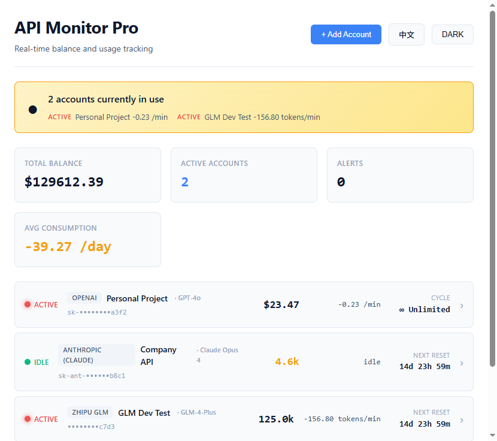

# Coding Plan Monitoring System

[中文](README_CN.md) | [English](README.md)

> *Know your API usage. Before your plan runs out.*

You have 5 AI provider accounts across OpenAI, Anthropic, GLM, Google, Azure — each with different billing cycles, quotas, and reset dates.

**Who's using what, right now? Will any account exhaust before reset?**

CPMS answers both questions in seconds. Desktop app. Real-time monitoring. Zero cloud dependency.

---

## Screenshots

**Light Mode / Dark Mode — Bilingual UI with real-time status**

<table>
  <tr>
    <td></td>
    <td></td>
  </tr>
</table>

**Add Account — Provider + Model selection**

<p></p>

---

## What It Does

CPMS monitors multiple AI API accounts in one window. Each account gets a 10-second **snapshot detection** (is someone using this right now?) followed by 60-second **long-term tracking** (consumption rate, prediction).

```
You (Desktop App)
  ↕
Monitor Core
  ↕
┌─────────────┬──────────────┬──────────────┬──────────────┐
│ OpenAI      │ Anthropic    │ GLM          │ Gemini       │
│ GPT-4o      │ Claude Opus4 │ GLM-4-Plus   │ Gemini 2.5   │
│ $23.47      │ 4,580 tokens │ 125k tokens  │ $8.92        │
│ ACTIVE ✓    │ IDLE         │ ACTIVE ✓     │ DETECTING    │
│ -0.23/min   │              │ -156.8/min   │              │
└─────────────┴──────────────┴──────────────┴──────────────┘
  ↕
Prediction Engine → "GLM will exhaust 45k tokens before reset (78% confidence)"
```

---

## Features

- **Two-stage monitoring** — 10s snapshot + 60s long-term tracking. Know instantly if anyone is using an API.
- **Multi-provider support** — OpenAI, Anthropic (Claude), Zhipu GLM, Google Gemini, Azure OpenAI.
- **Model-level granularity** — Each account binds to a specific model (GPT-4o, Claude Opus 4, GLM-4-Plus, etc.).
- **Plan reset countdown** — Real-time days/hours/minutes until quota resets.
- **Overspend prediction** — Confidence-scored forecast: will this account run out before reset?
- **Bilingual UI** — Chinese / English one-click switch. All text, symbols, and formats are i18n'd.
- **Dark / Light theme** — System-adaptive or manual toggle.
- **Privacy-first** — All data stays local. API keys stored in OS credential manager. Zero telemetry.

---

## Prerequisites

| Requirement | Version | Check |
|-------------|---------|-------|
| Node.js | >= 18 | `node --version` |
| Rust | >= 1.75 | `rustc --version` (via [rustup.rs](https://rustup.rs)) |
| OS | Windows 10+ / macOS 12+ | Webview2 bundled on Windows |

---

## Quick Start

```bash
git clone https://github.com/creditai/Coding-Plan-Monitoring-System.git
cd Coding-Plan-Monitoring-System
npm install
npm run tauri dev      # development mode
npm run tauri build    # production build (.exe / .msi)
```

Output: `src-tauri/target/release/bundle/`

---

## Supported Providers & Models

| Provider | Models | Billing |
|----------|--------|---------|
| **OpenAI** | GPT-4o, GPT-4 Turbo, GPT-3.5-Turbo, o1, o3-mini | Pay-as-you-go |
| **Anthropic** | Claude Opus 4, Claude Sonnet 4, Claude Haiku 3.5 | Monthly / Quarterly |
| **Zhipu GLM** | GLM-4-Plus, GLM-4-Air, GLM-4-Flash, GLM-4-Long | Monthly Coding Plan |
| **Google** | Gemini 2.5 Pro, Gemini 2.5 Flash, Gemini 2.0 Flash | Pay-as-you-go |
| **Azure OpenAI** | GPT-4o, GPT-4 Turbo, DALL-E 3 | Enterprise |

---

## Tech Stack

| Layer | Tech |
|-------|------|
| Desktop Framework | [Tauri 2.0](https://v2.tauri.app/) (Rust + Webview2, ~5MB bundle) |
| Frontend | React 18 + TypeScript + Vite |
| State Management | [Zustand](https://zustand.pmnd.rs/) |
| i18n | Custom bilingual system (zero runtime deps) |
| Styling | CSS Variables (light/dark themes) |

---

## Security

| Concern | Solution |
|---------|----------|
| API Key Storage | OS native credential manager (Windows Credential Manager / macOS Keychain) |
| JWT Tokens | In-memory cache, auto-refresh on expiry |
| Network | HTTPS enforced, certificate verification |
| Local Data | SQLite with optional encryption |

---

## FAQ

**Q: Does CPMS send my API keys to any server?**
A: No. Everything runs locally. Keys never leave your machine.

**Q: Can I monitor accounts from the same provider?**
A: Yes. Add as many accounts per provider as you need. Each has independent tracking.

**Q: How accurate is the overspend prediction?**
A: It uses historical consumption rate extrapolated to the remaining time before reset. Confidence score reflects data sufficiency — more usage history = higher confidence.

**Q: Does it work without internet?**
A: The UI works offline, but balance queries require network access to each provider's API.

**Q: Can I use it on macOS or Linux?**
A: Yes. Tauri supports all three platforms. Build with `npm run tauri build` on each.

---

## License

[MIT](LICENSE)

---
<p align="center">Made by <a href="https://github.com/creditai">creditai</a></p>
