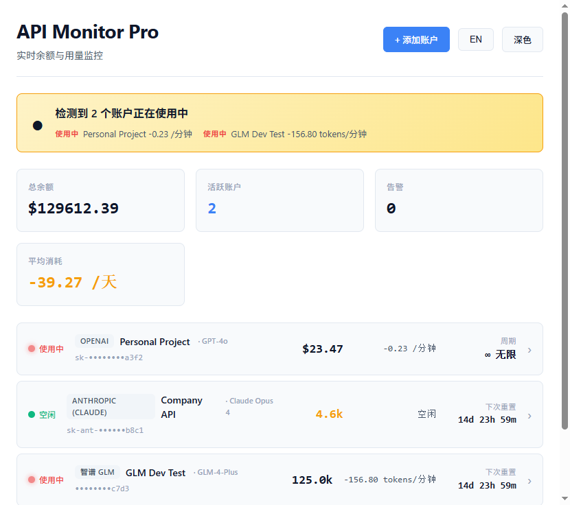
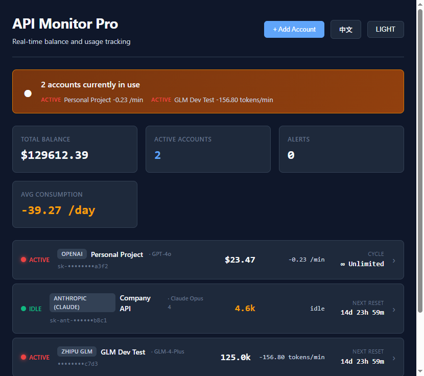
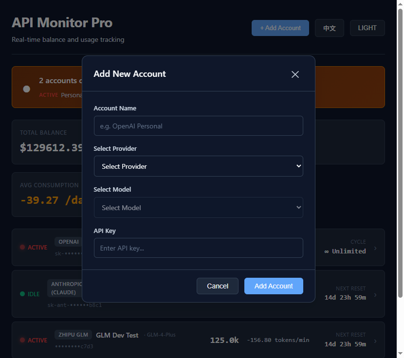

# Coding Plan Monitoring System

[中文](README_CN.md) | [English](README.md)

> *掌握你的 API 用量。在配额耗尽之前。*

你同时使用 OpenAI、Anthropic、GLM、Google、Azure 五家 AI 服务商的多个账户——每个账户有不同的计费周期、配额和重置日期。

**谁在用什么？现在用着吗？哪个账户会在重置前超支？**

CPMS 在几秒内回答这两个问题。桌面应用。实时监控。零云端依赖。

---

## 界面预览

**浅色模式 / 深色模式 — 中英双语实时状态**

<table>
  <tr>
    <td></td>
    <td></td>
  </tr>
</table>

**添加账户 — 服务商 + 模型联动选择**

<p></p>

---

## 核心功能

CPMS 在一个窗口内监控多个 AI API 账户。每个账户先经过 **10 秒快照检测**（现在有人在用吗？），然后进入 **60 秒长效追踪**（消耗速率、预测分析）。

```
你 (桌面应用)
  ↕
监控核心
  ↕
┌─────────────┬──────────────┬──────────────┬──────────────┐
│ OpenAI      │ Anthropic    │ GLM          │ Gemini       │
│ GPT-4o      │ Claude Opus4 │ GLM-4-Plus   │ Gemini 2.5   │
│ $23.47      │ 4,580 tokens │ 125k tokens  │ $8.92        │
│ 使用中 ✓    │ 空闲         │ 使用中 ✓     │ 检测中       │
│ -0.23/分钟  │              │ -156.8/分钟  │              │
└─────────────┴──────────────┴──────────────┴──────────────┘
  ↕
预测引擎 → "GLM 将在重置前耗尽约 45k tokens（置信度 78%）"
```

---

## 功能特性

- **两段式监控** — 10 秒快照 + 60 秒长效追踪。启动即知是否有人在使用。
- **多服务商支持** — OpenAI、Anthropic (Claude)、智谱 GLM、Google Gemini、Azure OpenAI。
- **模型级粒度** — 每个账户绑定具体模型（GPT-4o、Claude Opus 4、GLM-4-Plus 等）。
- **Plan 重置倒计时** — 实时显示距配额重置的天/时/分。
- **超支预测** — 带置信度评分的预测：该账户会在重置前耗尽吗？
- **中英双语界面** — 一键切换。所有文本、符号、格式均国际化。
- **深色 / 浅色主题** — 跟随系统或手动切换。
- **隐私优先** — 所有数据本地存储。API 密钥存于操作系统凭据管理器。零遥测。

---

## 环境要求

| 依赖项 | 版本 | 检查命令 |
|--------|------|----------|
| Node.js | >= 18 | `node --version` |
| Rust | >= 1.75 | `rustc --version`（通过 [rustup.rs](https://rustup.rs) 安装） |
| 操作系统 | Windows 10+ / macOS 12+ | Windows 自带 Webview2 |

---

## 快速开始

```bash
git clone https://github.com/creditai/Coding-Plan-Monitoring-System.git
cd Coding-Plan-Monitoring-System
npm install
npm run tauri dev      # 开发模式
npm run tauri build    # 构建生产版本 (.exe / .msi)
```

输出位置: `src-tauri/target/release/bundle/`

---

## 支持的服务商与模型

| 服务商 | 支持模型 | 计费方式 |
|--------|---------|---------|
| **OpenAI** | GPT-4o, GPT-4 Turbo, GPT-3.5-Turbo, o1, o3-mini | 按量付费 |
| **Anthropic** | Claude Opus 4, Claude Sonnet 4, Claude Haiku 3.5 | 月付 / 季付 |
| **智谱 GLM** | GLM-4-Plus, GLM-4-Air, GLM-4-Flash, GLM-4-Long | 月付 Coding Plan |
| **Google** | Gemini 2.5 Pro, Gemini 2.5 Flash, Gemini 2.0 Flash | 按量付费 |
| **Azure OpenAI** | GPT-4o, GPT-4 Turbo, DALL-E 3 | 企业版 |

---

## 技术栈

| 层级 | 技术 |
|------|------|
| 桌面框架 | [Tauri 2.0](https://v2.tauri.app/)（Rust + Webview2，打包体积 ~5MB） |
| 前端 | React 18 + TypeScript + Vite |
| 状态管理 | [Zustand](https://zustand.pmnd.rs/) |
| 国际化 | 自定义双语系统（零运行时依赖） |
| 样式 | CSS 变量（深色 / 浅色主题） |

---

## 安全性

| 问题 | 方案 |
|------|------|
| API 密钥存储 | 操作系统原生凭据管理器（Windows Credential Manager / macOS Keychain） |
| JWT Token | 内存缓存，过期自动刷新 |
| 网络通信 | 强制 HTTPS，证书校验 |
| 本地数据 | SQLite，可选加密 |

---

## 常见问题

**Q: CPMS 会把我的 API Key 发送到服务器吗？**
A: 不会。所有操作均在本地完成，密钥不会离开你的机器。

**Q: 同一个服务商可以添加多个账户吗？**
A: 可以。每个服务商下可添加任意数量的账户，各自独立监控。

**Q: 超支预测准确度如何？**
A: 基于历史消耗速率推算到剩余时间。置信度反映数据充足程度——使用历史越长，置信度越高。

**Q: 断网时能用吗？**
A: UI 可离线工作，但余额查询需要网络访问各服务商 API。

**Q: 支持 macOS 和 Linux 吗？**
A: 支持。Tauri 跨平台构建，在各系统上执行 `npm run tauri build` 即可。

---

## 许可证

[MIT](LICENSE)

---
<p align="center">由 <a href="https://github.com/creditai">creditai</a> 制作</p>
